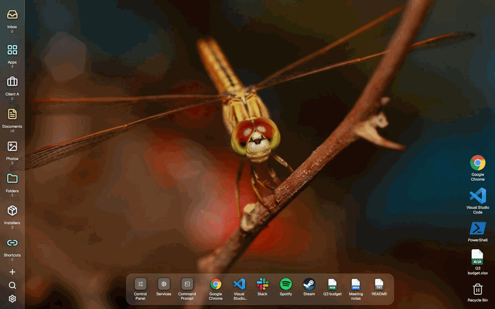

# Alcove

Give every icon a home.



Alcove is a Windows desktop organizer. It replaces the loose grid of icons on your
desktop with named groups — **Alcoves** — that open one at a time, spread across the
desktop when they get big, and keep their own arrangement per monitor. It reads the
real files on your Windows Desktop and opens them with the real Windows shell;
nothing is copied or moved unless you move it.

As a desktop app it draws itself onto the desktop in place of Explorer's icons. In a
browser it runs as a clickable mock with sample data, which is how you develop it.

## Install

Download the installer from the [latest release](https://github.com/izkac/alcove/releases/latest) and run it. It installs for the current user,
adds Alcove to the Start menu, and registers it to start at sign-in. You can turn
sign-in start off in Settings; uninstalling removes it.

To build the installer yourself, see [Building](#building) below.

## What it does

- **Organizes your Desktop into drawers.** On first run Alcove sorts what is already
  on your Desktop into Apps, Documents, Photos, Folders and Installers — or you can
  start with an empty Inbox and file things yourself.
- **Opens one drawer at a time.** Click a drawer's tile in the rail to open it, click
  again to close. The wallpaper stays clear the rest of the time.
- **Grows into a canvas, not across the wallpaper.** Small drawers open as a compact
  panel. Past twelve items a drawer opens spread across the desktop instead, where
  you can make named rows and drag icons between them.
- **Mirrors real folders.** Point a drawer at a folder on disk and it shows that
  folder's live contents, with icon, list and details views and sortable columns.
- **Notices new files.** Alcove watches your Desktop folder, so anything another
  program saves there turns up in the Inbox without a restart.
- **Takes its colour from your wallpaper.** Surfaces sit one step above the
  picture in its own hue, so Alcove looks like part of the desk rather than an
  app on top of it. Right-click the wallpaper to change the picture or swap it
  for a plain colour.
- **Learns what you open.** The frequent strip along the top or bottom edge fills
  itself with what you actually use. Slots hold their position as ranks shift, so
  nothing moves under your cursor mid-click.
- **Gives each monitor its own desk.** Drawers belong to a screen, and you can move
  them between screens. The layout is saved per desk.
- **Keeps Windows working.** Running apps stay on the Windows taskbar, files open
  with their real shell associations, and the Recycle Bin behaves like the Recycle
  Bin. Alcove organizes the desktop; it does not replace Explorer.

Full instructions are in the [User Guide](docs/user-guide.md).

## Running from source

Requires Node.js. The desktop app additionally needs
[Rust](https://www.rust-lang.org/tools/install) and the MSVC Build Tools.

Browser mock — sample data, no Windows integration:

```bat
npm install
npm run dev
```

Vite serves it at http://127.0.0.1:43147.

Desktop app — the real thing, against your real Desktop:

```bat
npm run desktop
```

This covers the desktop with the Alcove UI and hides Explorer's icons. The Windows
taskbar stays. Do not run `npm run dev` at the same time; they share port 43147.

If icons vanish and the app is stuck, press **Ctrl+Shift+F12** to release the
desktop, or restart Explorer.

## Building

```bat
npm run installer
```

Produces a current-user NSIS installer at
`src-tauri\target\release\bundle\nsis\`. The window stays hidden until it already
covers the desktop, so it does not appear small and then stretch.

## Licence

Alcove is open source under the [MIT licence](LICENSE). Read it, build it, change
it, fork it, redistribute it, sell it — the licence asks only that the copyright
notice travels with the source. Contributions come in under the same terms.

It is built on Tauri, React, Rust and other open source components, each under
its own licence.

Alcove changes how the Windows desktop is drawn and reads the files on it. It is
designed not to move or delete anything you did not ask it to, and it never
copies your files anywhere. It comes with no warranty of any kind; you use it at
your own risk.

## Releasing an update

Alcove updates itself. Shortly after it starts, the primary desk asks
`https://github.com/izkac/alcove/releases/latest/download/latest.json` whether
there is a newer build and offers it as a toast; Settings → System → Updates
checks on demand. A failed check is silent — being offline is not an event.

Updates are signed, and the app refuses anything that does not verify against
the public key in `tauri.conf.json`. The private key is at
`%USERPROFILE%\.tauri\alcove.key`, is **not** in this repo, and cannot be
regenerated: lose it and existing installs can never be updated again. Back it
up somewhere you would not lose a password.

To cut a release:

1. Bump `version` in `package.json` and `src-tauri/tauri.conf.json`.
2. Tag it with a message and push:

```bat
git tag -a v0.2.5 -m "What changed, in the words users will read."
git push origin v0.2.5
```

The tag message becomes the release body *and* the `notes` the updater shows
people in the update prompt, so write it for them rather than for yourself.

`.github/workflows/release.yml` builds the installer, signs the updater
artifacts and drafts a GitHub release holding the `.exe`, the `.exe.sig` and
`latest.json`. It stays a **draft** on purpose: the updater reads
`releases/latest`, so nothing reaches existing installs until you publish it.
The workflow needs `TAURI_SIGNING_PRIVATE_KEY` (the key's contents, not its
path) and `TAURI_SIGNING_PRIVATE_KEY_PASSWORD` as repository secrets.

To build one locally instead:

```bat
set TAURI_SIGNING_PRIVATE_KEY_PATH=%USERPROFILE%\.tauri\alcove.key
set TAURI_SIGNING_PRIVATE_KEY_PASSWORD=
npm run installer
```

Everything lands in `src-tauri\target\release\bundle\nsis\`.

Installing runs the NSIS installer, which takes the running Alcove down with it.
Because Alcove hides Explorer's icon list while attached, the update path hands
the desktop back *between* the download and the install — after the installer
starts, none of our code is guaranteed to run again.

## Where your settings live

Layout, drawers, pins and preferences are written to
`%APPDATA%\com.alcove.desktop\desktop.json`. Deleting that file resets Alcove to a
fresh desktop; it never touches your files.

## Development

```bat
npm run check    # assert-based checks for the pure logic modules
npm run lint     # oxlint
npm run build    # tsc -b && vite build
```

`npm run check` runs the `*.check.ts` files next to the modules they cover. Logic
with a branch or a rule in it is expected to leave one of these behind.

## Stack

Vite, React, TypeScript, Tailwind CSS, shadcn/ui, and Tauri 2. The Windows
integration — harvesting Desktop icons, extracting shell icons, the Recycle Bin,
the taskbar, desktop attachment — is Rust in `src-tauri/`.

## Not in this slice

Explorer context menus.
